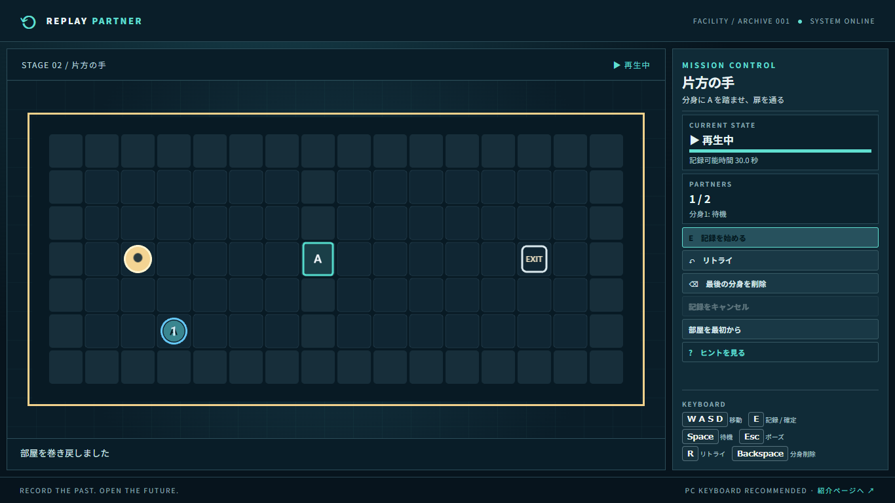

# Replay Partner / リプレイ・パートナー

過去の自分の行動を記録・再生し、分身と協力して出口を目指す2Dパズルです。全10部屋。現在の開発対象はUnity製Windows版で、初期のブラウザ版も残しています。

## Unity版を確認する

- [作品紹介・実画面・技術的な工夫](docs/PORTFOLIO.md)
- [操作とUnityプロジェクトの起動](unity/README.md)
- [検証済みの範囲と未確認事項](unity/QA.md)
- [制作物登録用の文章](docs/WORK_REGISTRATION.md)

最新版はRC6。正面／背面の探索者画像と歩行コマを追加しました。[配布ページ](https://github.com/yuuki20170731-svg/replay-partner/releases)でWindows配布候補版を確認できます。展開・再起動・音量保存の実画面確認はRC2時点の結果です。RC6はロジック・画面生成テストとビルドを確認し、全10部屋の手動通しプレイと新版動画は本人希望で保留しています。

Unity 2D版は [unity/README.md](unity/README.md) に追加しました。人間の主人公が石造りの迷宮から脱出する10部屋の作品で、床・壁・門・鍵・石箱・主人公の専用イラスト、脇道の鍵、分身と床スイッチ、状態が分かるUIを実装しています。Unity Editorで10ステージのテストとWindows版ビルド・起動を確認しました。WebGL版はモジュールの管理者承認待ちで未ビルドです。このページで遊べる既存版は引き続きPhaser製です。

制作者: 田中 優輝 / Yuki Tanaka（千葉工業大学 情報変革科学部 認知情報科学科）。

GitHub: [ソースと検証資料](https://github.com/yuuki20170731-svg/replay-partner)。ゲームの公開URLはCloudflareへの配置と動作確認後に追加します。

以下の画像・動画・遊び方は初期ブラウザ版のものです。Unity新版の映像ではありません。



[約59秒の実プレイ動画（無音）](public/videos/demo.webm)も収録しています。

## 遊び方

1. WASD / 矢印キーで移動します。
2. Eで記録開始。スイッチを踏む、箱を押すなどの行動を記録します。
3. 再びEで確定すると部屋が初期状態に戻り、分身が行動を再生します。
4. 分身と役割を分け、現在の自分で出口に到達します。

`Space`: 待機、`R`: 分身を残してリトライ、`Backspace`: 最後の分身を削除、`Esc`: ポーズ。記録キャンセルと全初期化は画面ボタンから行えます。ゲーム入力は盤面にフォーカスがある間のみ受け付けます。

## 起動と検証

Node.js 24、pnpm 11を使用します。

```bash
pnpm install
pnpm dev
```

ブラウザで表示されたローカルURLを開きます。紹介ページから「ゲームを遊ぶ」を選べます。

```bash
pnpm lint
pnpm typecheck
pnpm test
pnpm build
pnpm preview
```

`dist/` が本番用の静的ファイルです。Cloudflare Workers Static Assets向け設定は `wrangler.jsonc` にあります。

## 技術と設計

- TypeScript: 判定と画面状態の型を明示。
- Phaser 3: 盤面のCanvas描画。ゲーム判定は依存させず、Node上でテスト可能。
- Vite: 開発サーバーと静的ビルド。紹介ページはゲーム本体を初回読み込みしない別入口。
- localStorage: クリア状況と設定を保存。壊れたデータ・保存不可では初期値で起動。

記録には座標ではなく `up/down/left/right/wait` の行動列を保存します。古い分身から順に同じ移動処理を適用し、扉を更新します。位置の強制再生はしません。全10ステージの解法は `tests/simulation.test.ts` で記録・確定・再生を通して検証します。

## UI/UX

分身には番号、スイッチと扉には共通のA/B、現在の自分には異なる輪郭を付けました。状態、残り記録時間、分身の状態、操作を一画面に表示します。リトライ・削除・ヒントは常時見えるボタンです。紹介ページはPC以外の幅でも閲覧できますが、ゲーム操作はPCキーボードを完成対象とします。

## 実施した検証と制約

ローカルでlint・型検査・単体テスト・本番ビルドを実行し、Chromeで全10ステージを画面操作でクリアしました。具体的な結果は `docs/VERIFICATION.md`。スクリーンリーダーでCanvas内の全プレイを可能にする対応は未実施です。第三者プレイテスト、公開後の検証、実測プレイ時間も未実施です。

GitHubリポジトリは一般公開済みです。Cloudflareの公開URLはまだありません。架空のURLは置いていません。

## AI・素材・ライセンス

OpenAI Codexを設計、実装、文章、検証補助に利用しました。作者本人の確認・修正範囲は未確定です。ブラウザ版の画像はCSS/SVG/Phaser描画、効果音はWeb Audio生成です。Unity版の迷宮画像はOpenAIの画像生成機能で本作向けに作成し、効果音はコードで生成しました。第三者のゲーム素材は使用していません。コードの公開ライセンスは作者確認前のため未指定です。

詳細: [仕様](docs/REQUIREMENTS.md) · [設計](docs/DESIGN.md) · [アーキテクチャ](docs/ARCHITECTURE.md) · [就活向け説明](docs/PORTFOLIO.md) · [進行状況](docs/STATUS.md)
