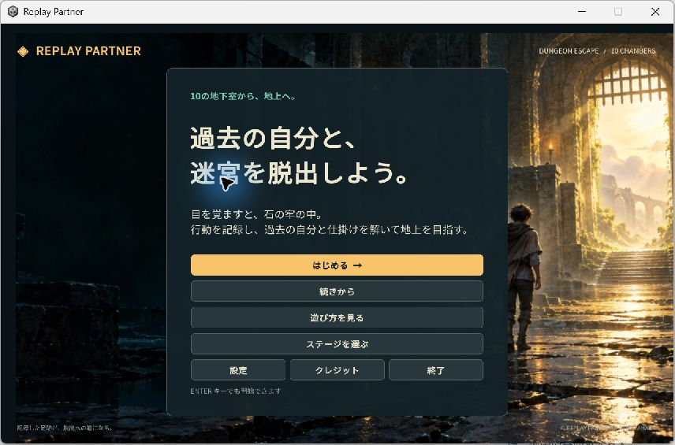
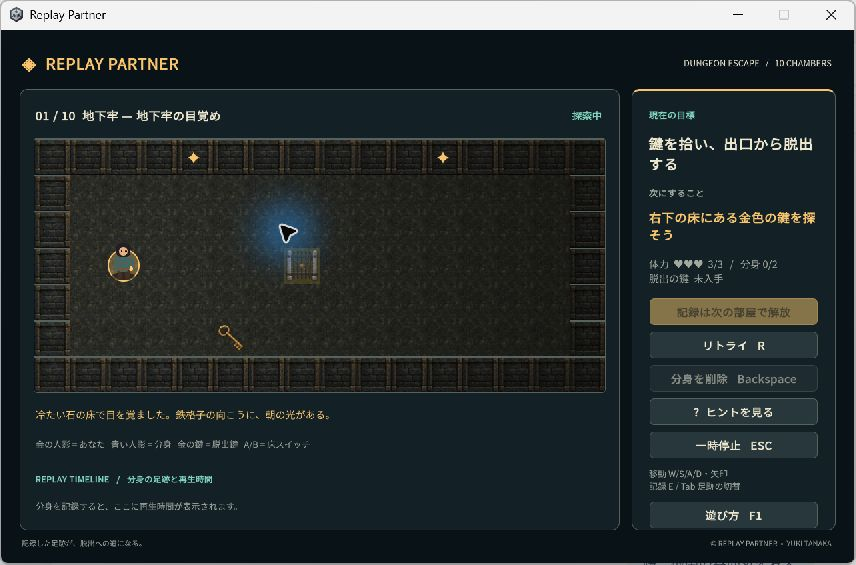
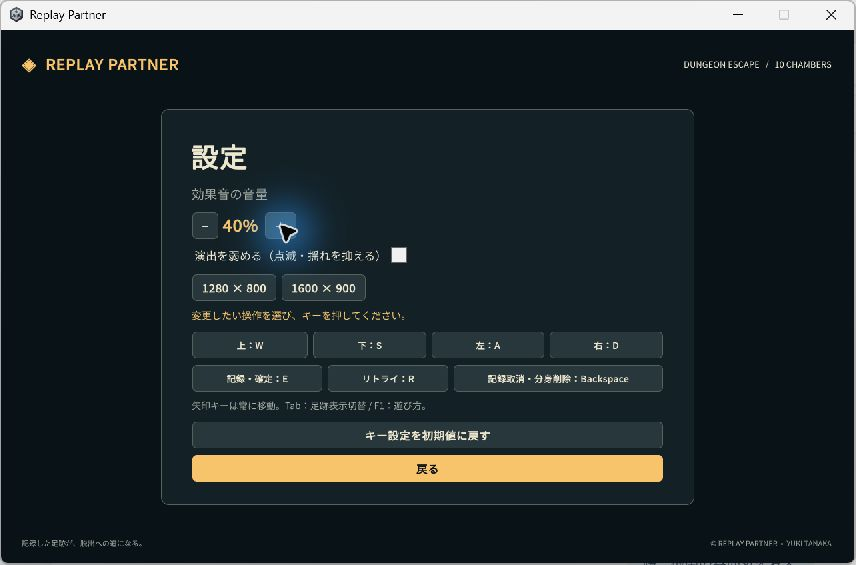

# Replay Partner — 作品紹介

過去の自分の行動を記録し、再生する分身と役割分担して迷宮を脱出するパズル。Unity 6 / C# / UI Toolkit製、Windows配布候補版、全10部屋です。

## 30秒で分かる遊び

移動して床スイッチまでの行動を記録し、確定すると分身が再生します。分身が門を開けている間に現在の自分が先へ進みます。後半は2体の分身・箱・鍵・予告付き罠を組み合わせます。

画像は配布ZIPを別フォルダーへ展開して起動した実画面です。全10部屋の手動クリアの証拠ではありません。

## 技術的な課題と工夫

| 課題 | 実装した解決方法 | 確認方法 |
| --- | --- | --- |
| 分身同士が箱・門へ干渉する | 60Hzの入力記録。古い分身→新しい分身→人間の順に処理し、各行動後に門を更新 | 10部屋の解法と端数位置再生を自動テスト |
| 複数の状態を理解しにくい | 目標・次の行動・状態・操作の順に整理。記録した足跡、停止地点、罠の秒数を表示 | 全室の画面生成テスト、限定範囲の実画面確認 |
| 操作変更で移動不能になる | 重複・固定矢印・UI予約キーを拒否。不正な保存設定は初期値へ戻す | 自動テストと実画面で予約キー拒否を確認 |
| 配布時にファイルが欠ける | 実行ファイルに操作・技術・検証・ライセンス資料を同梱 | 展開した139ファイルをSHA-256照合、別フォルダーで起動・再起動 |

音量、キー設定、画面サイズ、演出軽減をまとめています。全面的なスクリーンリーダー対応は未実装です。

詳しい設計は [技術説明](../unity/TECHNICAL.md)、検証結果は [QA](../unity/QA.md)、提出欄向け原稿は [登録用文章](WORK_REGISTRATION.md) を参照してください。

## 再現・配布と現在の制約

Unityプロジェクトは `unity/`。既存のブラウザ版はTypeScript・Phaser 3・Viteです。最新版RC6は正面／背面の探索者画像を使用。掲載スクリーンショットはRC2時点です。[Windows配布候補版](https://github.com/yuuki20170731-svg/replay-partner/releases)を展開し、`Windows-RC6/ReplayPartner.exe` を起動します。フォルダー内のデータを省かず配布してください。

開発機1台で確認した候補版です。全10部屋の通常操作の通しプレイとUnity新版の動画は本人希望で保留。第三者・別PCテスト、WebGLは未検証。OBSは導入しません。RC6のロジック・画像切替・画面生成テストとビルドは成功し、実画面確認は操作停止により未完了です。

AI（Codex）を実装・検証・文章作成の支援に使用。本人の制作場所・期間・担当範囲は確認待ちで、実績や単独実装を推測で記載しません。
